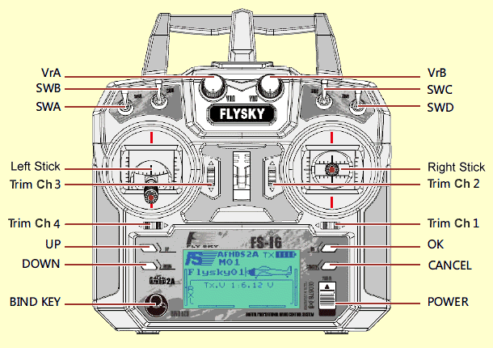
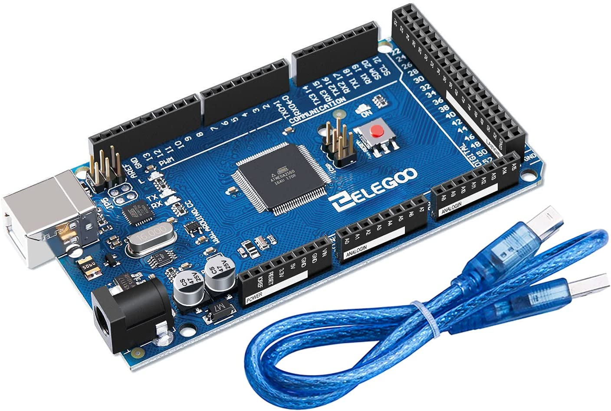
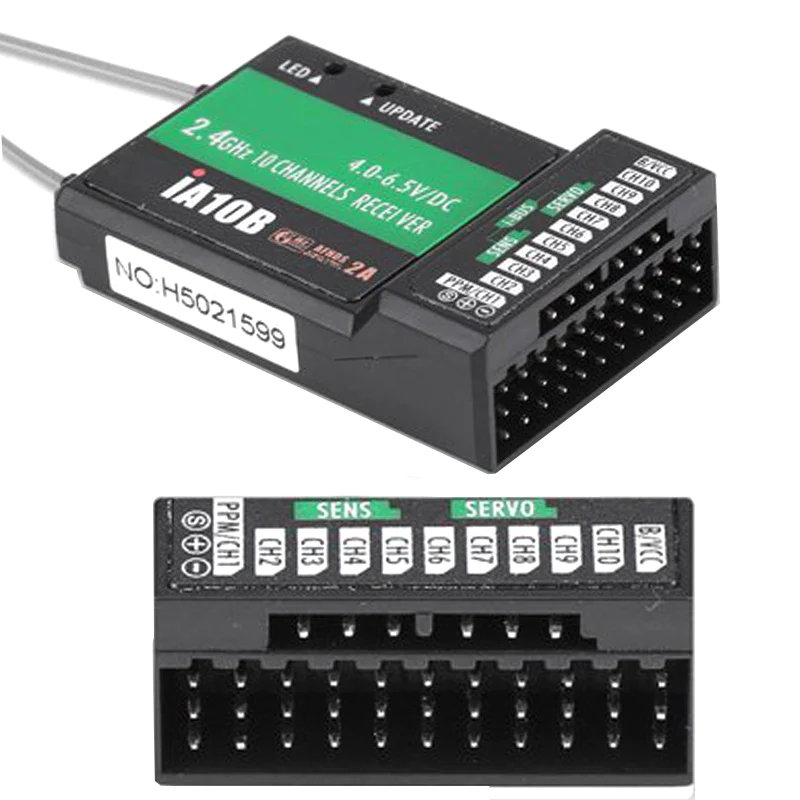
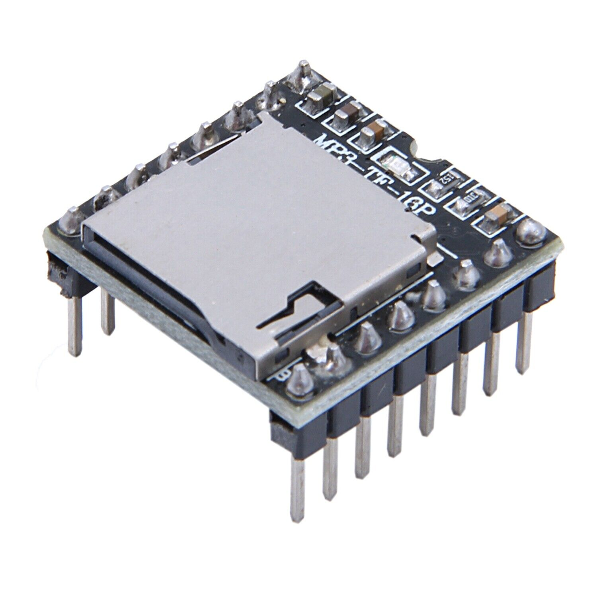
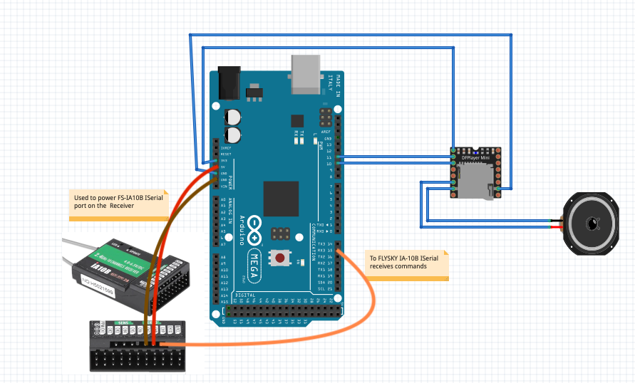

# Rogue One 

## Overview 
This is a modification of the Shady_RC by JoyMonkey. This was made to use the Flysky controller with 10 channels. The FS-I6X is relatively cheap digital controller. It uses a receiveer that has an IBus interface which plugs into the ATMega board. There is some setup with the controller out of the box. That is basically to assign the keys or map the keys to the right functions. This is more based off of ShadyRC, with modifications to a 10 channel receiver. 

**Reference repositories:** 

[Shadown MD](https://www.printed-droid.com/kb/shadow-md-droid-control-system/)

[ShadyRC_Evelotion](https://github.com/joymonkey/dEvolution/blob/master/sketches/ShadyRC_Evolution/ShadyRC_Evolution.ino)

## FlySKY setup
There are two menu options if you long press the top right or **OK** button it brings you to a setup menu. Press the up and down buttons on the left side to select if you want to system setup or functions setup.

Press the select button or **OK** again "top right button" to make the menu selection.

To back out of an option press the lower right button or **Cancel** button. 

TO SAVE your options LONG press the cancel button. This is so un intutitive. 

The following is what is set up under each of the menu settings (system and function). All the other settings are left alone and uses the default settings.

**System Setup** 
1. Set the model TYPE to *standard airplane or glider*

**Function Setup**
1. Reverse to all normal

**Aux. Channels**
1. Channel 5 = *Swa*
2. Channel 6 = *SwB*
3. Channel 7 = *VrA*
4. Channel 8 = *VrB*
5. Channel 9 = *SwC*
6. Channel 10 = *SwD*

## Transmitter orientation/navigation

The following actions do the following. 

### On Start up
All toggles are up and the sticks for channel 1-4 are in neutral or down positions.

| SwA | SwB | VrbA | VrbB | SwC | SwD | Description |
| ----|-----|------|------|-----|-----|-------------|
| From Up to Down| N/A   | N/A n | Adjust Volume | Middle position | Up | Play Cantina music|
| From Down to Up| N/A   | N/A  | Adjust Volume | Middle position | Up | Play Starwars Intro music|
| N/A | Up to Down  | N/A | Adjust Volume | Middle position | Up | Play Imperial March music|
| N/A | Down to Up  | N/A | Adjust Volume | Middle position | Up | Play Starwars Disco music|
| N/A | N/A   | any position | N/A | middle to Up | Up | Play Random noise|
| N/A | N/A   | any position | N/A | middle to Down | Up | Play Random noise|
| N/A | N/A   | N/A | adjust | toggle to middle position | Up | Change volume|
| N/A | N/A   | N/A | N/A | N/A | toggle to down | Enable Auto Dome sounds|

# Electronics

**Parts list**
1. [ELEGOO MEGA R3 Board ATmega 2560 + USB Cable Compatible with Arduino IDE Projects RoHS Compliant](https://www.amazon.com/ELEGOO-ATmega2560-ATMEGA16U2-Projects-Compliant/dp/B01H4ZLZLQ?source=ps-sl-shoppingads-lpcontext&ref_=fplfs&psc=1&smid=A2WWHQ25ENKVJ1)
2. 
3. [Flysky FS-iA10B receiver](https://hobbymatehobby.com/products/flysky-fs-ia10b-10ch-receiver-for-transmitter-fs-i10-fs-i6s-th9x-for-fpv-drone-rc-helicopter-telemetry-receiver-w-ppm-sbus?currency=USD&variant=32274066309169&gclid=CjwKCAjw4JWZBhApEiwAtJUN0KOPYcFzvfXK9iQGjkgz_hnRVqH_rOxxC0v8As5NhFmXVAHhFa9pgRoCuk4QAvD_BwE)
4.   
5. [DFRobot DFPlayer](https://www.digikey.com/en/products/detail/dfrobot/DFR0299/6588463?utm_adgroup=TANE%20ALARM%20PRODUCTS&utm_source=google&utm_medium=cpc&utm_campaign=Shopping_DK%2BSupplier_Tier%202%20-%20Block%202&utm_term=&utm_content=TANE%20ALARM%20PRODUCTS&gclid=CjwKCAjw4JWZBhApEiwAtJUN0EJeeAKlE_UHkRag86wsOOUmCqrXYDFXIqQU01XdTdXRZyFKTjDDXhoCWKMQAvD_BwE)
7.   
8. Micro SD Card 
9. 3.5 Speaker

The wiring looks something like this for the basic sound system. 

